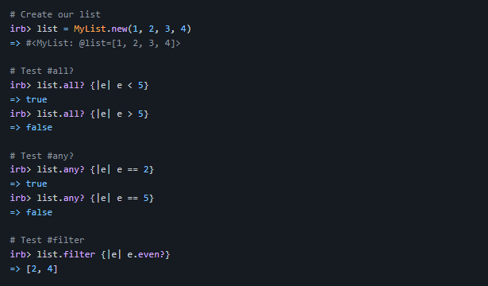

## Getting Started

This repository includes files with plain .rb that can be used to apply some methods on an array

# Enumerable
- Use [enumerable.rb](./enumerable.rb) to use any? ,  all? and filter functionality.

# Set up
make sure that you have ruby downloaded on  your computer [install ruby](https://www.ruby-lang.org/en/documentation/installation/)
Install

## Usage
use the methods in module.rb to apply (any?, all? and filter ) methods by define an instance of my list class then use these methods on an array

# Run tests

try this code to test the methods

## Authors

👤 **Meqdam Al-qudah**

- [GitHub](https://github.com/MeqdamAlqudah)
- [Twitter](https://twitter.com/MeqdamQudah)
- [LinkedIn](www.linkedin.com/in/meqdam-al-qudah-7514a21b5)

👤 **OLATUNJI AZEEM**

- [GitHub](https://github.com/zemola)
- [Twitter](https://twitter.com/zemolat)
- [LinkedIn](www.linkedin.com/in/olatunjiazeem)
## 🤝 Contributing

Contributions, issues, and feature requests are welcome!

Feel free to check the [issues page](../../issues/).

## Show your support

Give a ⭐️ if you like this project!

## Acknowledgments

- Hat tip to anyone whose code was used
- Inspiration
- etc

## 📝 License

This project is [MIT](./MIT.md) licensed.